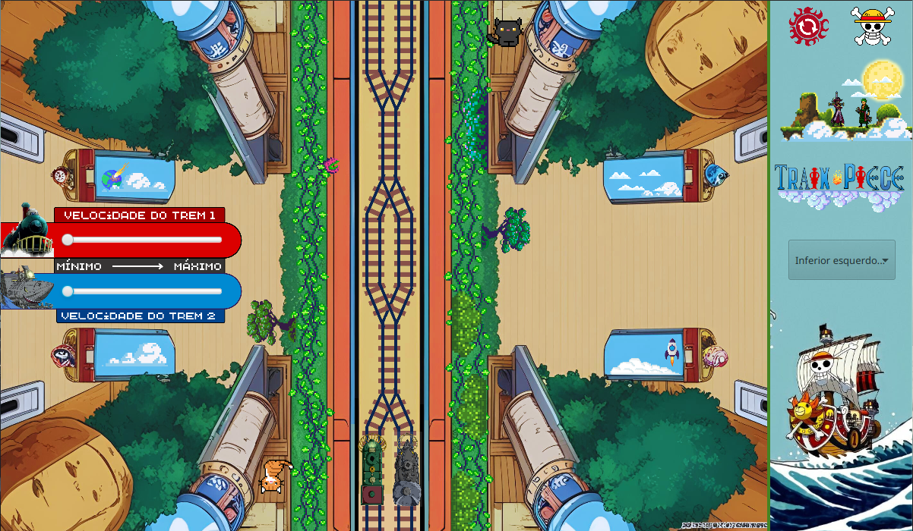

# 🚆🏴‍☠️ Trens - Sem controle de concorrência

Repositório para agregar o projeto de **Simulação de Condições de Corrida entre trens por trilhos**, desenvolvido em **Java** com interface gráfica em **JavaFX**.  

O projeto tem como objetivo demonstrar, de forma prática, as condições de corrida geradas por trens, que compartilham trilhos em variadas combinações de posicionamentos iniciais do trajeto.

---

## 🧩 Funcionalidades
- Simulação de corrida entre trens em trilhos compartilhados.  
- Manipulação da velocidade de movimentação dos trens.
- Escolha dos posicionamentos iniciais dos trens na tela.
- Interface gráfica desenvolvida em **JavaFX**.

---

## 🛠️ Tecnologias Utilizadas
- **Java 8**  
- **JavaFX**
- Padrão de arquitetura **MVC (Model-View-Controller)**  

---

## 📂 Estrutura do Projeto

```

├── assets/         # Recursos estáticos (imagens, ícones etc.)
├── controller/     # Lógica de controle da aplicação
├── model/          # Classes de modelagem do projeto
├── util/           # Classe de utilidade auxiliar
├── view/           # Marcação gráfica (FXML)
└── Principal.java  # Classe principal de execução

```

---

## 🖥️ Execução
1. Clone este repositório:
   ```bash
   git clone https://github.com/ItaloSLeao/Simulacao-Trens-Concorrente.git
   ```
   
2. Abra o projeto em um Terminal de Comandos. Compile e execute a classe **Principal.java** usando os comandos:

   ```java
   javac Principal.java
   java Principal

3. Aprecie

   
   
---

## 🎓 Contexto Acadêmico

Este projeto foi desenvolvido como parte da disciplina Programação Concorrente, com o objetivo de estruturar o ponto inicial da compreensão das condições de corrida entre processos.

---

## 📄 Licença

Este projeto é de uso acadêmico e está sob a licença MIT.
